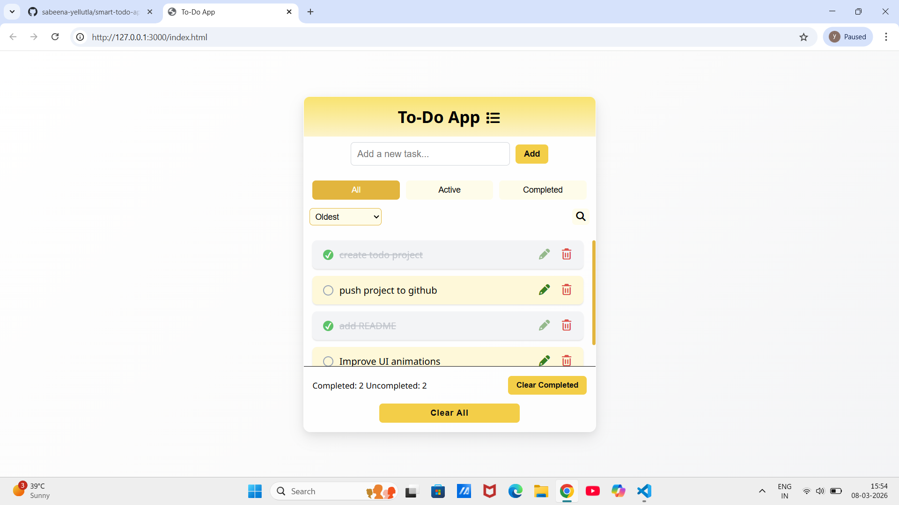

# Smart Todo App
A modern responsive Todo application built using HTML, CSS, JavaScript.

## Live Demo
[View Live Porject](https://sabeena-yellutla.github.io/smart-todo-app/)

## Features: 
- Add new tasks
- Edit tasks
- Delete tasks
- Mark tasks as completed
- Filter tasks (All / Active / Completed)
- Sort tasks (Newest / Oldest)
- Search tasks
- Debounced search for persistance
- LocalStorage persistance
- Responsive design
- Smooth UI animations
  
## Technologies Used:
HTML
CSS
JavaScript
LocalStorage

Screenshot:

Author:
Sabeena Yellutla
